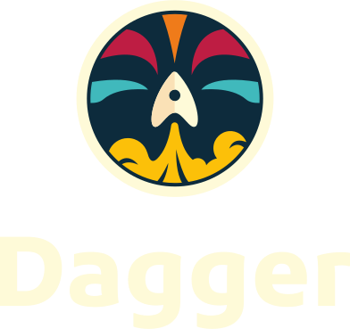
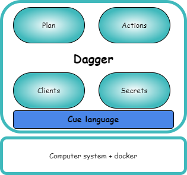
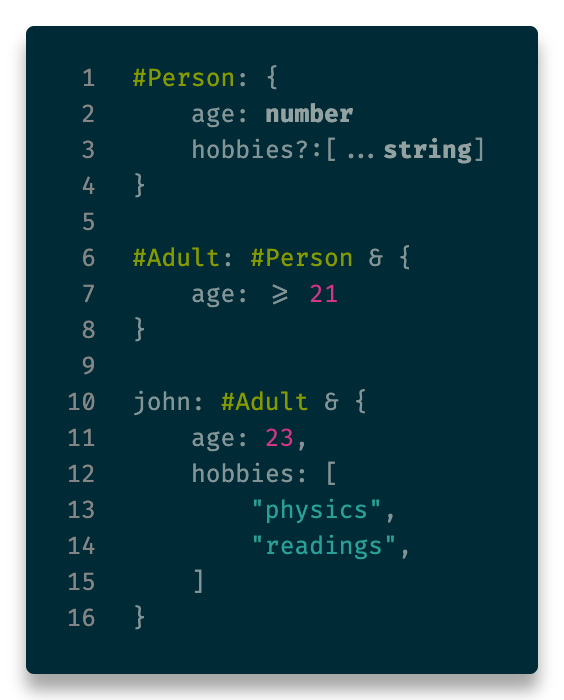
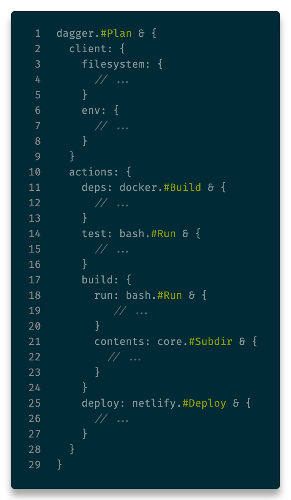

<!-- _class: main -->

# Accelerate pipeline library creation

Laurent Gil and Guillaume Camus

---

# Who are we?

## [Laurent GIL](https://www.linkedin.com/in/laurent-gil/?locale=en_US)

DevOps Coach,
AWS Solution Architect,
Kubernetes evangelist

## [Guillaume CAMUS](https://www.linkedin.com/in/guillaumecamus/?locale=en_US)

Developer and Quality Engineer

---

# Problem statement

- How to accelerate the value stream of engineering teams
- How to quickly push new ideas to production
- How to adopt an application centric workflow to decrease the cycle time
- How to enable a smooth communication between engineering teams and platform ones

---

# Multiple tools / solutions

- Internal Developer Platform
- Infrastructure as code libraries
- 👉 **Pipeline libraries** 👈

---

# Why create a pipeline library

- Decrease developer workload to push code to production
- Mutualize pipeline best practices across the company
  - DevSecOps
  - Compliance
  - Tests
- Break silos
- Improve cycle time

---

# Pipeline library development challenges

- KISS, Keep It Simple & Stupid
- Avoid the one size fits all solution
- Create a portable library (avoid orchestrator lock-in)
- Enable productivity by allowing job local execution

---

# What problems Dagger address

By using a container approach, Dagger solved the following issues :

- 👉 **Create a portable library (avoid orchestrator locking)** 👈
- 👉 **Enable productivity by allowing job local execution** 👈

---
<!-- _class: header -->

---

# History

- First line of code in **December 2020** by **Solomon Hykes**'team (ex-docker)
- **Independent** and **agnostic** of any language
- **Can be used locally**

<!--
Dagger is portable and compatible
-->

---

# How does it work

- *Plan*: Contain actions
- *Actions*: Define jobs to execute
- *Clients*: Interact with the underlying operating system
- *Secrets*: Store sensitive data

---

# About CUE

CUE has all the features you wish in YAML or JSON:

- string interpolation,
- templating,
- static type checking,
- data validation,
- code generation,
- even scripting,

<!--
- Created by google
- Originally designed to configure Borg, the K8s predecessor
-->

---

# Hands-on time

---

# Idea

- Typed input because of CUE language

---

# <!-- fit --> All start with a **Plan**

