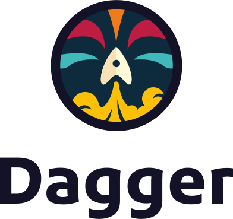

<!-- https://marpit.marp.app/directives -->

# Accelerate pipeline library creation

## with Dagger

---
<!-- _class: white -->
# Who are we?

## [Laurent GIL](https://www.linkedin.com/in/laurent-gil/?locale=en_US)

**DevOps Coach,
AWS Solution Architect,
Kubernetes evangelist**

## [Guillaume CAMUS](https://www.linkedin.com/in/guillaumecamus/?locale=en_US)

**Developer and Quality Engineer**
Curious, I like to design things and check if the design is viable and fits the needs.

---

# Problem statement

- How to accelerate the value stream of engineering teams
- How to enforce continuous integration and continuous deployment best practices
- How to decrease the amount of work made by developers to go to production

---

# Multiple tools / solutions

- Internal Developer Platform
- Infrastructure as code libraries
- **Pipeline libraries**

---

# Pipeline library development pain points

- KISS, Keep It Simple & Stupid
- Create a portable library
- Test pipeline jobs on development environment
- Locally reproduce the CI / CD execution context

---

# What problems Dagger address

By using a container approach, Dagger solved the following issues :

- Create a portable library
- Test pipeline jobs on development environment
- Locally reproduce the CI / CD execution context

---

<!-- _class: white -->

# Workflow automation is a real pain

- you have to build, test, lint,   sign, deploy ...
- *CI environment* is not **not synchronized**   with your *dev environment*
  <!--
  - the development environment is different from one developer to another, and is rarely consistent with that of the CI
  -->
- you have to **maintain scripts**
  <!--
  - these scripts are rarely tested
  -->
- Easy to make **configuration mistakes**
  <!--
  - there is no schema to validate the configuration. You can have a valid YAML file, but it is not understood by the CI. For example, define an environment variable with a boolean type.
  -->
- there is always a new workflow,  a good practice
  <!--
  - there is always a new workflow, good practices to execute. This has the consequence that developers spend too much time on it instead of developing.
  So what do we do? We write scripts to automate all these workflows and tasks we have to perform.
  -->
  <!--
  Homemade scripts that do the job but then they don't really evolve and as the team grows, the project grows, the script grows and the technical debt grows and begins to introduce problems  that you can't test. You don't understand how it works and the person who wrote them three years ago is gone.
  -->

> **All this combined consumes a lot of time**

---
<!-- _class: white -->

# A pipeline library to do what?

- **share** and **reuse**  the work of other teams
  <!--
  - have a modular and composable API
  -->
- run in a **unified way** in any  language (java, golang, nodejs,...)
- unit testing of tasks / jobs

---

---
# History

- First line of code in **December 2020** by **Solomon Hykes**'team (ex-docker)
- **Independent** and **agnostic** of any language
- **Can be used locally**

<!--
Dagger is portable and compatible
-->

---

# How it works

- *Plan*: Contain actions
- *Actions*: Define jobs to execute
- *Clients*: Interact with the underlying operating system
- *Secrets*: Store sensitive data
  
---

# About CUE

<!--
- Created by google
- Originally designed to configure Borg, the K8s predecessor
-->
- Open-source data validation language and inference engine
- Data validation
- Data templating
- Configuration
- Querying
- Code generation
- Even scripting

---

# Hands-on time

---

# <!-- fit --> All start with a **Plan**

