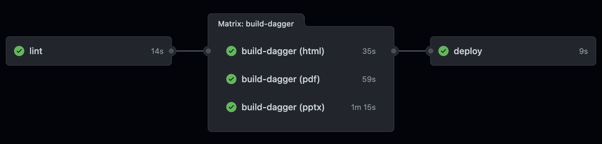
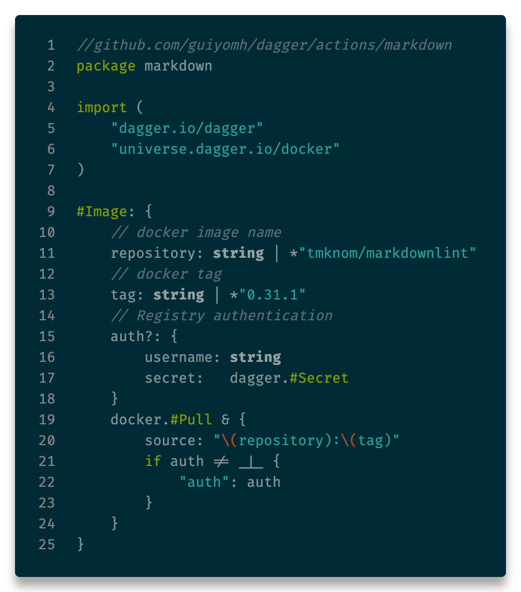
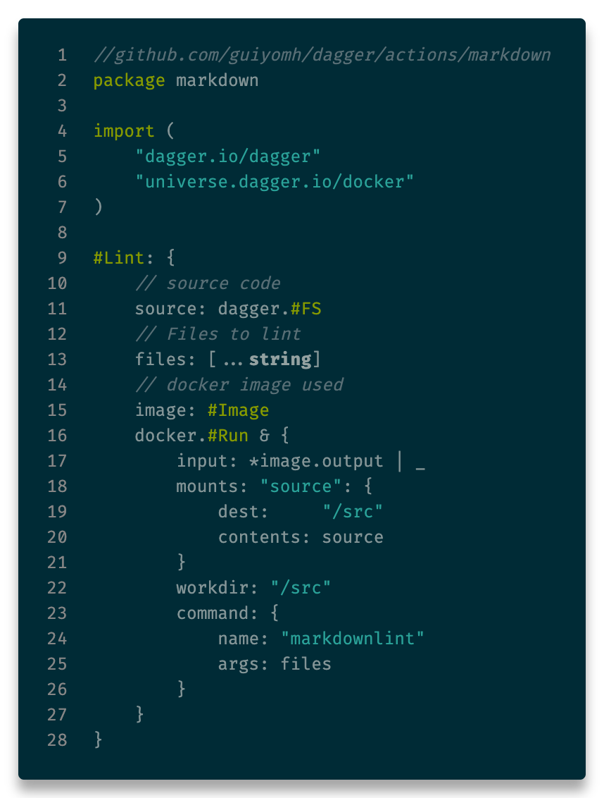
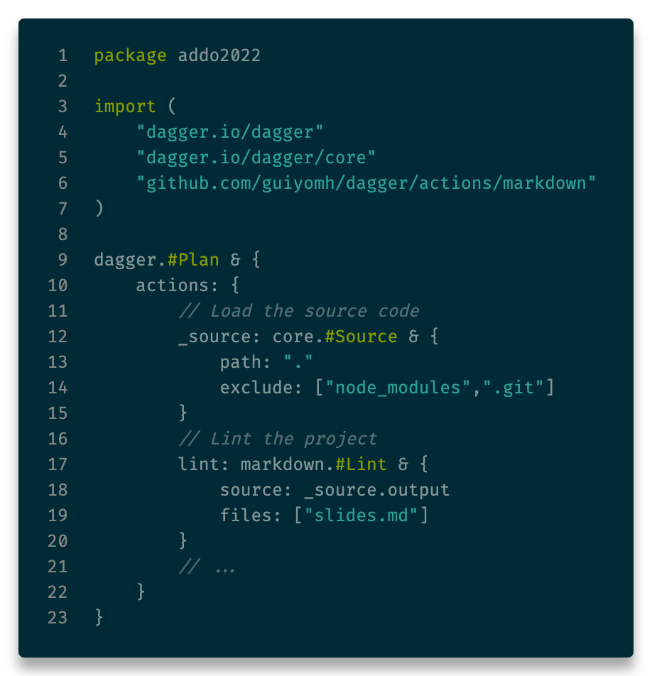

<!-- _class: main -->

# Accelerate pipeline library creation

Laurent Gil and Guillaume Camus

---

# Who are we?

## [Laurent GIL](https://www.linkedin.com/in/laurent-gil/?locale=en_US)

DevOps Coach,
AWS Solution Architect,
Kubernetes evangelist

## [Guillaume CAMUS](https://www.linkedin.com/in/guillaumecamus/?locale=en_US)

Developer and Quality Engineer

---

<!--
Nowadays, companies are engaged in a production value race. They need to continuously increase the customer value in pushing new ideas to production with a lean approach.

To achieve it, they often adopt the DevOps culture trying to continuously improve value streams to always produce quicker with a better quality.

During this journey, frameworks and tools allowing a better communication between the engineering teams and the operation ones are created.

This is the type of issue we have tried to solve.
-->

# Problem statement

- How to accelerate the value stream of engineering teams
- How to quickly push new ideas to production
- How to adopt an application centric workflow to decrease the cycle time
- How to enable a smooth communication between engineering teams and platform ones

---

<!--

Multiple solutions are commonly adopted such as :
- Internal Developer Platform
- IaaC libraries
- Pipeline libraries

Today, we will introduce a product which will address the pipeline library issue.

Usually pipeline libraries are created by a team of experts with good automation skills, and a strong test culture. In addition to those skills, the team members are also familiar with advance deployment workflow as well as with infrastructure and configuration management. So that they can help the engineering team to become autonomous to publish their application to production.
-->

# Multiple tools / solutions

- Internal Developer Platform
- Infrastructure as code libraries
- 👉 **Pipeline libraries** 👈

---

# Why create a pipeline library

- Decrease developer workload to push code to production
- Mutualize pipeline best practices across the company
  - DevSecOps
  - Compliance
  - Tests
- Break silos
- Improve cycle time

---

# Pipeline library development challenges

- KISS, Keep It Simple & Stupid
- Avoid the one size fits all solution
- Create a portable library (avoid orchestrator lock-in)
- Enable productivity by allowing job local execution

---

# What problems Dagger address

By using a container approach, Dagger solved the following issues :

- 👉 **Create a portable library (avoid orchestrator locking)** 👈
- 👉 **Enable productivity by allowing job local execution** 👈

---
<!-- _class: header -->

---

# Overview

- First line of code in **December 2020** by **Solomon Hykes**'team (ex-docker)
- **Independent** and **agnostic** of any language
- **Can be used locally**

<!--
Dagger is a programmable CI/CD engine that runs your pipelines in containers.
Dagger executes your pipelines entirely as standard OCI containers. This has several benefits:

- Instant local testing
- Portability: the same pipeline can run on your local machine, a CI runner, a dedicated server, or any container hosting service.
- Superior caching: every operation is cached by default, and caching works the same everywhere
- Compatibility with the Docker ecosystem: if it runs in a container, you can add it to your pipeline.
-->
---

# <fit> How does it work ?

<!--
1. You need to install Dagger.
2. Using the SDK library, your program opens a new session on a Dagger engine.
3. Using the SDK library, your program prepares API requests describing the pipelines to be executed and sends them to the engine.
4. When the engine receives an API request, it computes a Directed Acyclic Graph (DAG) of operations and starts processing the operations simultaneously.
5. When all operations in the pipeline have been resolved, the engine returns the pipeline result to your program.
6. Your program can use the pipeline result as input for new pipelines.
-->

---

# Some concept

- **Plan**: is the pipeline manifest.
  - **Actions**: Define jobs to execute
  - **Clients**: Interact with the underlying operating system

<!--
All starts with a plan.
Within this plan we can:

- interact with the client
  - read  /write files on the host
  - read env variables in the host
- declare actions
-->

---

# About CUE

CUE has all the features you wish in YAML or JSON:

- string interpolation
- templating
- static type checking
- data validation
- code generation
- even scripting

<!--
It is a configuration language created by google.
Originally, it was used to configure Borg, the predecessor of the K8.
Cue is a mix between YAML and JSON with additional features.

Currently, we used to validate configuration files.

Here you have an example of what can be done with cue.
We describe a Person structure. This structure is composed of an age and a list of hobbies.

Then we describe another structure Adult which inherits from Person, but which adds a constraint on the age.

And finally we implement the Adult structure with John. Of course, if we put an age lower than 21, Cue would have raised an error.

Dagger uses this language to describe the pipeline. This is very useful, because if we make an error we are immediately alerted, because the plan does not compile.
-->

---
<!-- _class: header -->

# Hands-on time

<!--
Now it's time to practice.
-->

---

# Use case

A simple pipeline to build the presentation slides.

3 steps:

- 👉 **lint** 👈
- 👉 **build** 👈
- deploy

Github: [guiyomh/dagger-addo](https://github.com/guiyomh/dagger-addo)

<!--
Let's take a simple use case.
We made this presentation in markdown.
The slides are versioned in Github, built with Github Action and hosted on Github Pages.

We have a simple pipeline. In 3 steps:
- we have a linter to make sure the markdown is correct.
- then we have a build task for the slides.
- then we publish the slides on Github pages
-->

---

# <!--left--> All start with a Plan

---

# Import dependencies

- Centrally develop common actions
- Speed up pipeline creation by mutualizing / reusing code
- Compose pipeline from reusable actions

---

# Lint action

---

# Lint usage

---

# Build

- Chain multiple steps
- Export action onto the host file system

---

# Integration with GitHub

[View code on GitHub](https://github.com/guiyomh/dagger-addo/blob/main/.github/workflows/marp-to-pages.yml)

---
<!-- _class: thank -->

Thank for all
