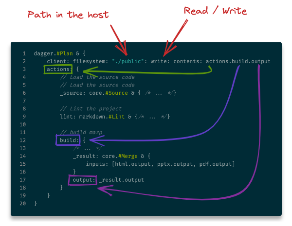

<!-- _class: main -->

# Accelerate pipeline library creation

Laurent Gil and Guillaume Camus

---

# Who are we?

## [Laurent GIL](https://www.linkedin.com/in/laurent-gil/?locale=en_US)

DevOps Coach,
AWS Solution Architect,
Kubernetes evangelist

## [Guillaume CAMUS](https://www.linkedin.com/in/guillaumecamus/?locale=en_US)

<!--
I am Guillaume. I've been working at manomano for 5 years where I had several roles,
Lead Developer, QA, and now QE.
My goal is to reduce the friction and time wasted due to an ecosystem in order to improve the developer.experience.
-->

Developer and Quality Engineer

---

<!--
Nowadays, companies are engaged in a production value race. They need to continuously increase the customer value in pushing new ideas to production with a lean approach.

To achieve it, they often adopt the DevOps culture trying to continuously improve value streams to always produce quicker with a better quality.

During this journey, frameworks and tools allowing a better communication between the engineering teams and the operation ones are created.

This is the type of issue we have tried to solve.
-->

# Problem statement

- How to accelerate the value stream of engineering teams
- How to quickly push new ideas to production
- How to adopt an application centric workflow to decrease the cycle time
- How to enable a smooth communication between engineering teams and platform ones

---

<!--

Multiple solutions are commonly adopted such as :
- Internal Developer Platform
- IaaC libraries
- Pipeline libraries

Today, we will introduce a product which will address the pipeline library issue.

Usually pipeline libraries are created by a team of experts with good automation skills, and a strong test culture. In addition to those skills, the team members are also familiar with advance deployment workflow as well as with infrastructure and configuration management. So that they can help the engineering team to become autonomous to publish their application to production.
-->

# Multiple tools / solutions

- Internal Developer Platform
- Infrastructure as code libraries
- 👉 **Pipeline libraries** 👈

---

# Why create a pipeline library

- Decrease developer workload to push code to production
- Mutualize pipeline best practices across the company
  - DevSecOps
  - Compliance
  - Tests
- Break silos
- Improve cycle time

---

# Pipeline library development challenges

- KISS, Keep It Simple & Stupid
- Avoid the one size fits all solution
- Create a portable library (avoid orchestrator lock-in)
- Enable productivity by allowing job local execution

---

# What problems Dagger address

By using a container approach, Dagger solved the following issues :

- 👉 **Create a portable library (avoid orchestrator locking)** 👈
- 👉 **Enable productivity by allowing job local execution** 👈

---
<!-- _class: header -->

<!--
Why are we presenting Dagger today?

This is a tool that we discovered last April.
And on the paper, it answers some of our problems to create a pipeline library.

I'm not used to being a speaker, but the tool has helped me a lot
and I wanted to give you some feedback on it.
-->

---

# Overview

- First line of code in **December 2020** by **Solomon Hykes**'team (ex-docker)
- **Independent** and **agnostic** of any language
- **Can be used locally**

<!--
Dagger is a programmable CI/CD engine that runs your pipelines in containers.
This has several benefits:

- Instant local testing: I can modify the pipeline and test it locally before sharing it
- Portability: the same pipeline can run on your local machine, a CI runner, a dedicated server,...
- Superior caching: every operation is cached by default, and caching works the same everywhere
- Compatibility with the Docker ecosystem: if you have a tool that works in a container. You can add it to your pipeline.
-->
---

# <fit> How does it work ?

<!--
Dagger comes as an overlay to docker.
It works in client server mode. You have a sdk that allows to communicate with dagger engine.
And dagger engine prepares the instructions and sends them to the container runtime.
Which will execute your pipeline.
-->

---

# Some concept

- **Plan**: is the pipeline manifest.
  - **Actions**: Define jobs to execute
  - **Clients**: Interact with the underlying operating system

<!--
All starts with a plan.
Within this plan we can:

- interact with the client
  - read  /write files on the host
  - read env variables in the host
- declare actions
-->

---

# About CUE

CUE has all the features you wish in YAML or JSON:

- string interpolation
- templating
- static type checking
- data validation
- code generation
- even scripting

<!--
Dagger uses Cuelang to describe the pipelines.

It is a configuration language created by google.
Originally, it was used to configure Borg, the predecessor of the K8.
Cue is a mix between YAML and JSON with additional features.

Currently, we used to validate configuration files.

Here you have an example of what can be done with cue.
We describe a Person structure. This structure is composed of an age and a list of hobbies.

Then we describe another structure Adult which inherits from Person, but which adds a constraint on the age.

And finally we implement the Adult structure with John. Of course, if we put an age lower than 21, Cue would have raised an error.

Dagger uses this language to describe the pipeline. This is very useful, because if we make an error we are immediately alerted, because the plan does not compile.
-->

---
<!-- _class: header -->

# Hands-on time

<!--
Now it's time to practice.
-->

---

# Use case

A simple pipeline to build the presentation slides.

3 steps:

- 👉 **lint** 👈
- 👉 **build** 👈
- deploy

Github: <https://github.com/guiyomh/dagger-addo>
Slides: <https://guiyomh.github.io/dagger-addo>

<!--
Let's take a simple use case.
We made this presentation in markdown.
The slides are versioned in Github, built with Github Action and hosted on Github Pages.

We have a simple pipeline. In 3 steps:
- we have a linter to make sure the markdown is correct.
- then we have a build task for the slides.
- then we publish the slides on Github pages
-->

---

# All start with a Plan

<!--
As we explained in the slide of dagger's concepts.
To describe your pipeline you need a Plan.

Concretely, this is what a plan looks like.

We find the action property, we will describe the tasks we want to execute.

And because dagger uses containers to execute actions.
We find the client property, which allows us to create the interactions between our host machine and the containers.

We can see that there are some particularities to the language with the hashtag in front of some key words.
-->

---

# Import dependencies

- Centrally develop common definitions
- Speed up pipeline creation by mutualize / reusing code
- Compose pipeline from reusable actions

<!--
These hashtags refer to definitions.
These definitions can be local (i.e. like the example I showed you with john implementing the Adult definition)

But the interest here is to be able to import external definitions. Dagger provides some definitions that can be used directly or combined to create new definitions.

This is the choice we made to create our library.

We made this choice because it allows us to centralize the common definitions between our different projects.
This avoids redeveloping the wheel for each project. This is a real time saver to start quickly.
It also allows us to ensure a relative homogeneity between projects.
-->

---

# Markdown definitions

<!--
Ok, let's start by creating our first definition.

For our action to run we need an image.
So we create an image definition. Which takes as input the name of the image
and the tag of the image.

As we have a private repository at ManoMano, we also add the possibility to define a username and a secret as input.
And finally, we use the definition provided by dagger to pull the image.

Now let's create our definitions for markdown lint.
We need the source of our project, and the list of files to transform into html.

We use the image property, to define the execution environment of our future action.

And finally, we use the definition `docker.Run` provided by dagger to run a command line in the container.

Okay!

Now that we have our definitions, how can we use them?
-->

---

# Lint in action

<!--
We start by importing our cue package.
Then we create a lint action that extends our markdown.#Lint definition (the red box)
And we define our source and file input parameters.
-->

---

# How to use a custom image?

<!--
As we have seen in the definition of the markdown lint.
We have an optional parameter, allowing us to specify the default image.

In this example, I start by defining some variables in the red box.

Then, I want to use an image from a private ECR registry. So I need to authenticate myself.
To do this, I plan an interaction with the host machine.
Here, in the green box, I ask to run a command on the host machine to get a token for ECR.

Then in the orange box, I use my definition markdown.image. I specify the repository, the tag and my credentials.

Now I can inject my custom image into my lint action. By linking image.markdownlint to the image input of my lint action.

That's it. It's not much more complicated than that.

Ok, I know how to create actions, but where is my pipeline?
-->
---

# Build

- Chain multiple steps
- Export action onto the host file system

<!--
To have a better understanding. Let's take the example of the action build.
It's an action a little more complex, because we build 3 media: html, pdf, powerpoint.

So we have created 3 sub-actions. They all take as input the sources of the project except the HTML action.
The Html action requires to copy the assets in the publication directory.
So we added a sub-action assets to do that.

And then we linked our actions together. Instead of taking the sources of the project as input,
the html action takes the output of the assets action (green box).

And finally, we merge the output of our 3 sub-actions (html, pdf, powerpoint) with the definition core.#Merge.
We get a file system with all the files generated.

But that's not all! We are in a container. So we have to write the build output on our host machine.
-->
---

# Interact with the host

<!--
To do this, we add a client:filesystem instruction to our plan.
We specify the directory or file we want to target.
We also specify with which right we want to access it (read/write).
And we link the output of our build actions to the content.
-->

---

<video controls="controls" src="assets/dagger-build.mov">

Video montrant l'execution de du pipeline

</video>

---
<!-- _class: header -->
# Our experience feedback

<!--
Dagger is a very young project that evolves very quickly.
With Laurent, we discovered it in April of this year and we liked it immediately.

On paper, it promises a nice developer experience. But we had some troubles.
In particular, the learning curve of Cuelang. We took cuelang for configuration format, but it is much more.

So, It took us a while to find a working pattern for what we wanted to do.

But the dagger teams are aware of this problem and announced in October the release of new SDK in NodeJS, Python, Golang.
-->

---
<!-- _class: thank -->

Thank for all
